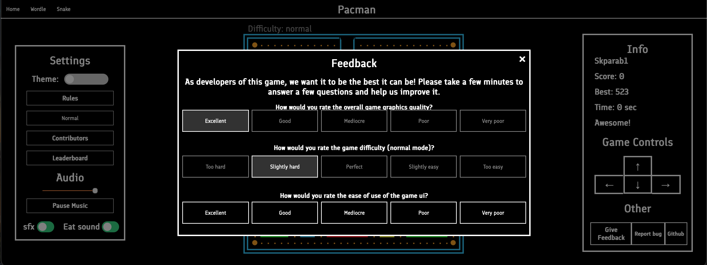

# Pacman • [Play](https://skparab1.github.io/pacman) • [Learn more](https://skparab1.github.io/pacman/about) • [Leaderboard](https://skparab1.github.io/pacman/leaderboard/leaderboard.html) • [Trailer]()
Developed by Shubham Parab, Ritam Chakraborty, Anish Lakkapragada, Advaita Guruprasad, Manav Choudhary, Anindit Pati, Agastya Pawate, Patrick Huang, and Abhinav Pala

# Features
## High quality adapting graphics
 
Pacman's high quality display ensures the most immersive experience for the player. Capable of 2k x 2k pixel display, the game ensures usage of maximum capability by always rendering a near full height display - no matter the device. In addition, the game calculates live fps for each play and adjusts the game speed accordingly, ensuring a fair experience for all players.

## Live ranked leaderboard
 
With a live ranked leaderboard, Pacman is designed to store the scores and time of every play, allowing players to compare scores in an enhanced game experience.

## Light and Dark modes
 
Light and dark mode theme settings, along with audio and sfx settings, allow users to customize their pacman experience and modify it to their preference.

## Background Music and Sound effects
 
The original background music and sound effects, created by Advaita Guruprasad enhance the experience and make it immersive

## 5 different game levels
 
With 5 unique game modes, users can play pacman to their comfortable difficulty, or play the original 3 life mode.

## Efficient and smart AI

A smart but efficient ai powering ghosts provides a challenging game without performing execessive calculations of the most efficient route. Instead, the ai compares the available directions at interection points and subsequently makes a decision, and coordinating with other ghosts, ensures a fun play.

## Feedback feature

Don't like something? Tell us and we will fix it! To make the game as perfect as possible, a feedback feature is in the game, and can be used by any player to give us information about how the game is, and how we can improve it.

## Screenshot feature

Want to see your game board after you lose? Screenshot feature enables you to do just that. once you get your screenshot, you can download it, get it in base64 data, or share it! It comes with a permanant link that you can send to others.

## Replay feature (beta)

Replay feature allows you to see your game again. and also provides a permanant sharable url. This is, however, a beta feature that is not perfect, so errors should be expected

# Contributers
- Developers: Shubham Parab, Ritam Chakraborty, Anish Lakkapragada, Agastya Pawate, Patrick Huang
- Design: Ritam Chakraborty, Manav Choudhary, Advaita Guruprasad, Shubham Parab, Anindit Pati, Abhinav Pala
- Music/Sound: Advaita Guruprasad

# Software and tools
- Game in HTML, HTML Canvas, Javascript and CSS
- Leaderboard database using deta base
